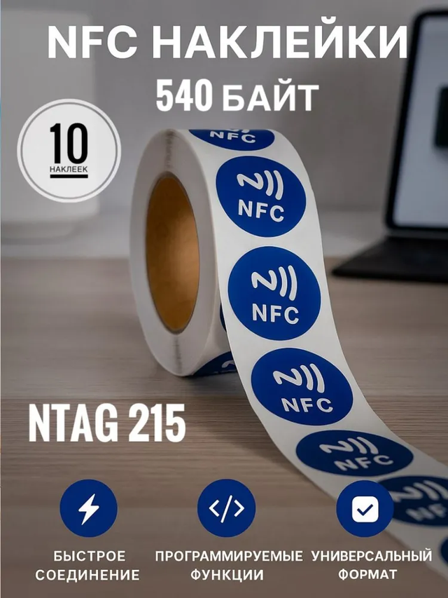
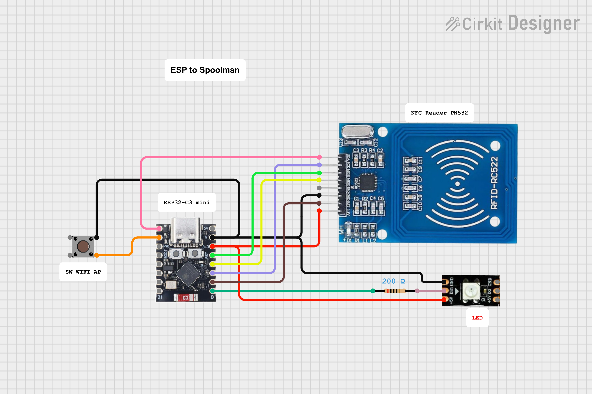
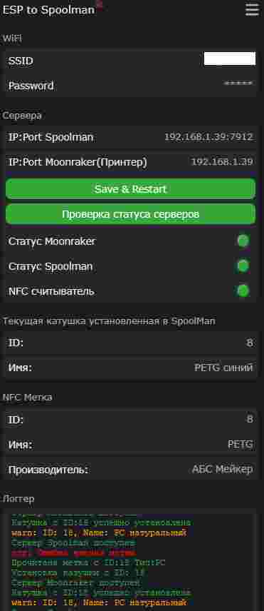
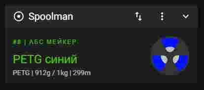

# ESP_TO_SPOOLMAN
Данный проект реализует считывание NFC меток типа NTAG2xx установленных на катушках с филаментом, и установку активной катушки в сервис [Spoolman]([https://github.com/ManuelW77/Filaman](https://github.com/Donkie/Spoolman#integration-status))  через Moonraker. Spoolman должен быть установлен и настроен в вашей сети и принтере.
## Используемые компоненты
1. Контроллер ESP32-C3 super mini
2. Считыватель NFC меток RFID-RC522
3. Светодиод WS2812B
4. Кнопка
5. Метки NTAG215, NTAG216
   
Проект выполнен для ESP32-C3 но можно установить на другой тип ESP32  с заменой пинов на соотвествующие.
Имеется web-интерфейс для настройки wifi и адресов серверов Spoolman и Moonraker. Так же там отображается состояние доступности серверов, считывателя и данные полученные с метки.

## Запись меток
Запись меток осуществляется с помощью проекта [FilaMan](https://github.com/ManuelW77/Filaman)
Метки можно применять такие NTAG215 

## СХЕМА
Схема подключения модуля и ESP32

## Pinout ESP32-C3 super mini

## Работа устройства
При включении ESP создает точку доступа с именем "ESP to Spoolman" и будет мигать синий светодиод к которой необходимо подключиться и перейти по IP 192.168.4.1. В  настройках необходимо ввести данные свой wifi сети, IP адрес сервера Spoolman, и IP адрес сервера Moonraker (ваш принтер с Klipper). И нажать кнопку "Save&Restart". После переподключения должны гореть зеленые светодиоды о доступности серверов и считывателя NFC. При необходимости нажать кнопку "Проверка статуса серверов". Светодиод на устройстве должен гороть зеленым. При поднисении метки к считывателю и успешном считывании метки светодиод мигнет желтым и установиться текущая катушка в web-интерфейсе вашего принтера. В случае ошибки чтения метки светодиод мигнет красным. Если красный горит постоянно значить потеряна связь с сервером или сетью. Подробный вывод ошибок и текущего состояния можно увидеть в логе в web-интерфейсе

## Вид web-интерфейса устройства

## Вид web-интерфейса принтера с установленной катушкой

## Общий вид устройства
Файлы для печати доступны 

